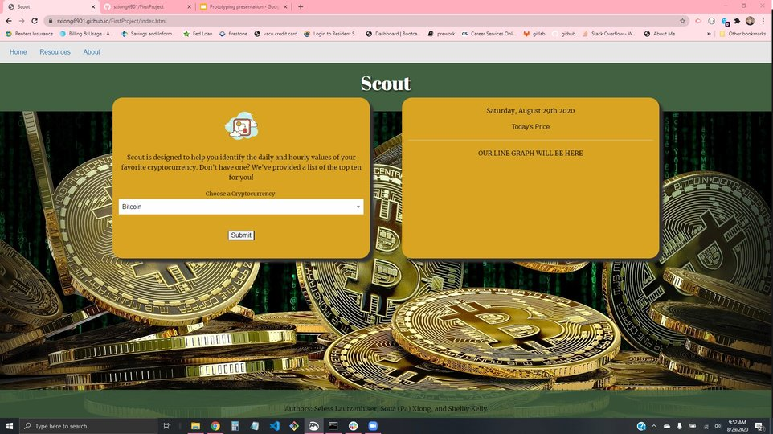

<ins>Scout</ins>
  
GitHub Repo:
    https://github.com/sxiong6901/FirstProject

Deployed Site:
    https://sxiong6901.github.io/FirstProject/

Google Slides Presentation:
    https://docs.google.com/presentation/d/1xbeEabEGi_IJjN43U0u4fE8Dd3Ib3a53vChHh_IEWUA/edit?usp=sharing

<ins>User Story</ins>

As a person who is interested in learning more about cryptocurrency

I want to be able to access a site that will allow me to access the current exchange rates for some of the top cryptocurrencies on the market

So that I can go into cryptocurrency exchanging with knowledge of current market values.

This site is a simple cryptocurrency search tool. When you access the landing page you will be presented with a dropdown box in which you can select one of the top 10 cryptocurrencies. The results will display in a box to the right along with a chart displaying historical data. 
This project is being created by Seless Lautzenhiser, Soua Xiong, and Shellby Kelly for the UNCC Full Stack Coding Bootcamp.

API for current cryptocurrencty exchange rates from: https://www.cryptocompare.com/
API for current date: https://momentjs.com/
Library for chart creation: https://www.chartjs.org/

